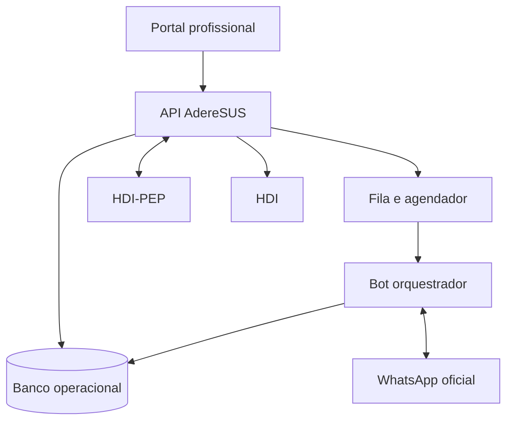

# Arquitetura

## Visão geral

O AdereSUS é um produto independente. Possui portal, API, banco operacional, agendador, fila, bot/orquestrador e adaptador do WhatsApp. HDI-PEP e HDI permanecem sistemas externos com responsabilidades próprias.

## Responsabilidades

### AdereSUS

Cadastro de vínculos, monitoramentos, tarefas, mensagens, respostas, ocorrências, intervenções e auditoria operacional.

### HDI-PEP

Identidade clínica vinculada, agenda/atendimento quando aplicável, prontuário longitudinal e resumos clinicamente relevantes.

### HDI

Indicadores agregados, continuidade, absenteísmo, adesão autorreferida, recuperação, filas e análise institucional.

## Regras arquiteturais

- uma única API oficial;
- módulos internos com limites explícitos;
- banco transacional normalizado;
- métricas derivadas por eventos, não pelo acoplamento direto das telas;
- operações assíncronas idempotentes;
- cada evento possui identificador e correlação;
- cada instituição acessa somente seu escopo;
- falha do WhatsApp não bloqueia o prontuário nem apaga o plano;
- adaptadores externos podem ser substituídos sem reescrever a regra clínica.
